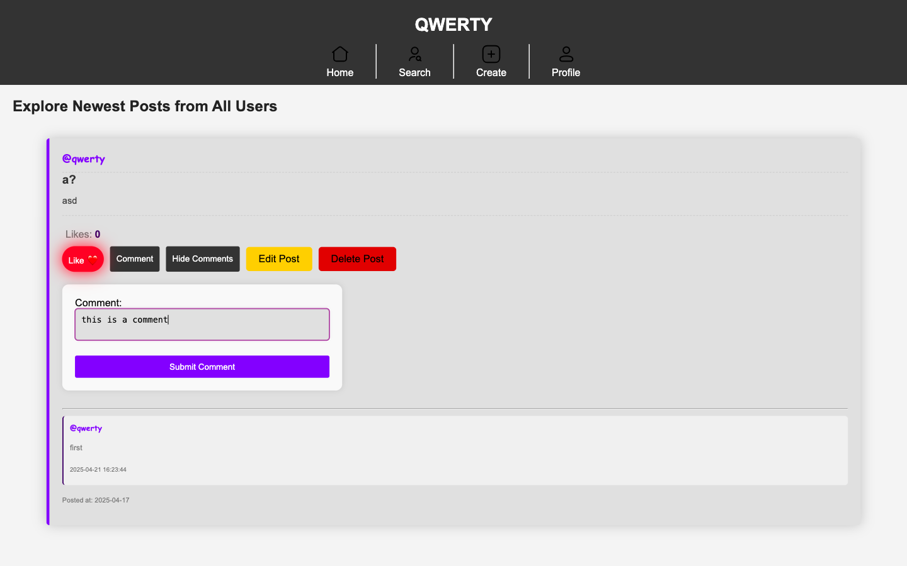

# WebDev-Project (QWERTY – The Social Network)

> [!IMPORTANT]
> This project is for educational purposes only and is not intended for production use.
> Created as part of second year of university, also you can see more my works for university at [this repo](https://github.com/DanyilT/projects-in-university).
> This is the Final Project for the Web Development Server-Side Module.

This repository contains the code for the QWERTY social network project, which is a web application designed to facilitate social interactions and connections among users. The project is built using PHP and MySQL, following the MVC (Model-View-Controller) architecture.

## Table of Contents

- [WebDev-Project (QWERTY – The Social Network)](#webdev-project-qwerty--the-social-network)
  - [Prerequisites](#prerequisites)
  - [Quick Setup](#quick-setup)
    - [Start MySQL Server](#start-mysql-server)
    - [Initialize the Database](#initialize-the-database)
    - [Populate the Database](#populate-the-database)
    - [Start the PHP Built-in Server](#start-the-php-built-in-server)
    - [Access the Application](#access-the-application)
  - [Installation](#installation)
  - [Running MySQL Server](#running-mysql-server)
  - [Running the Project](#running-the-project)
  - [Database Initialization](#database-initialization)
  - [Project Structure](#project-structure)
    - [Additional Information](#additional-information)
  - [Contributing](#contributing)
  - [License](#license)
    - [Authors](#authors)

## Prerequisites
- PHP (7.4 or higher I assume)
  - Extensions:
    - `pdo_mysql` For MySQL database connection
    - `gd` For image processing (if you want to use image upload feature)
- MySQL (5.7 or higher I assume)

## Quick Setup

### Start MySQL Server
Ensure your MySQL server is running. You can start it using the following command (depending on your system):
> [!TIP]
> - On Windows:
>   ```shell
>   # Start MySQL service
>   net start mysql80
>   
>   # Stop MySQL service
>   net stop mysql80
>   ```

### Initialize the Database
Drop the existing database (if any) and run the `install.php` script to create the database and necessary tables:
> [!TIP]
> Run the following commands in your MySQL client (e.g., MySQL Workbench, phpMyAdmin, or command line - MySQL shell):
>   ```shell
>   mysql -u <your_database_user> -p
>   enter password: <your_database_password>
>   ```
```sql
DROP DATABASE IF EXISTS qwertyDB;
CREATE DATABASE IF NOT EXISTS qwertyDB; -- (optional) becuse the database will be created automatically while running the install.php script
```
> [!TIP]
> Run the `php install.php` command in root directory of the project to create the necessary tables and initial data:
```sh
php install.php
```

### Populate the Database
You can populate the database with initial data by running the `populate.sql` script:
> [!TIP]
> (optional)
```sql
source data/populate.sql
```

### Start the PHP Built-in Server
Start the PHP built-in server to run the application:
> [!NOTE]
> This start the localhost web server on port 8000.
> Set /public as the document root.
> [!TIP]
> Run the following command in the root directory of the project:
```sh
php -S 127.0.0.1:8000 -t public
```

### Access the Application
Navigate to `127.0.0.1:8000` in your web browser to access the application.

## Demo

### Screenshots

Home page, post view


## Installation

> [!NOTE]
> Install PHP and MySQL on your local machine.
> And make sure you have the necessary extensions enabled in your `php.ini` file.
> And if you want to use PHPUnit for testing, you must install it separately.

> [!TIP]
> You can use [XAMPP](https://www.apachefriends.org) to set up a local development environment with PHP and MySQL.

1. **Clone the repository:**
    ```sh
    git clone https://github.com/yourusername/WebDev-Project.git
    cd WebDev-Project
    ```

2. **Create the database:**
    - Ensure your MySQL server is running.
      - On Windows:
        ```shell
        # Start MySQL service
        net start mysql80
        
        # Stop MySQL service
        net stop mysql80
        ```
      - On MacOS:
        - Check in system preferences if MySQL is running.
    - Drop the existing database (if any):
        ```sql
        DROP DATABASE IF EXISTS qwertyDB;
        ```
    - Create a new database named `qwertyDB` (optional, the database will be created automatically while running the `install.php` script):
        ```sql
        CREATE DATABASE IF NOT EXISTS qwertyDB;
        ```

3. **Configure the database connection:**
    - If you are a contributor, you can download the `config.php` as **artifact** from the **GitHub Actions** (last successful `Create Config` job).
      1. Go to the **Actions** tab.
      2. Click on the last successful **Create Config** job.
      3. Download the `config.php` artifact.
      4. Extract the `config.php` file and place it in the project root directory.
    - If you are not a contributor, you can create or edit the `config.php` file manually:
      - Create a new file named `config.php` in the project root directory, or open the existing [`config.php`](config.php) file (it has an empty fields).
      - Edit the [`config.php`](config.php) file with your database connection details:
          ```php
          return [
              'host' => 'localhost',
              'dbname' => 'your_database_name',
              'user' => 'your_database_user',
              'password' => 'your_database_password',
              'options' => [PDO::ATTR_ERRMODE => PDO::ERRMODE_EXCEPTION]
          ];
          ```

## Running MySQL Server

Ensure your MySQL server is running. You can start it using the following command (depending on your system):

- On Windows:
  ```shell
  # Start MySQL service
  net start mysql80
    
  # Stop MySQL service
  net stop mysql80
  ```

## Running the Project

1. **Start the PHP built-in server:**
    ```sh
    php -S 127.0.0.1:8000 -t public
    ```

2. **Access the application:**
    Open your web browser and go to [`http://127.0.0.1:8000`](http://127.0.0.1:8000).

## Database Initialization

```shell
mysql -u <your_database_user> -p
enter password: <your_database_password>
```

```shell
#creare database tables (schema) -- run the install.php script in another shell (or browser)
php install.php
```
```shell
#use and populate the database
source data/populate.sql
```

1. **Run the database initialization script:**
    - Run the `install.php` script to create the necessary tables and initial data:
        ```sh
        php install.php
        ```
    - Or you can run `php -S 127.0.0.1:8000` and open [`http://127.0.0.1:8000/install.php`](http://127.0.0.1:8000/install.php) in your browser.
    - Or you can run the SQL script manually:
        ```sh
        mysql -u <your_database_user> -p
        enter password: <your_database_password>
        CREATE DATABASE IF NOT EXISTS qwertyDB;
        ```
        ```sh
        mysql -u your_database_user -p your_database_name < data/init.sql
        ```

## Tests

### Unit Testing

#### Models

- [Post](tests/Models/Post)
  - **PostTest**
      - [Test Cases](tests/Models/Post/PostTest.php)
      - [Tested Class](src/Models/Post/Post.php)
  - **PostCommentTest**
      - [Test Cases](tests/Models/Post/PostCommentTest.php)
      - [Tested Class](src/Models/Post/PostComment.php)
  - **PostReactionTest**
      - [Test Cases](tests/Models/Post/PostReactionTest.php)
      - [Tested Class](src/Models/Post/PostReaction.php)
  - ** PostRepository**
      - [Test Cases](tests/Models/Post/PostRepositoryTest.php)
      - [Tested Class](src/Models/Post/PostRepository.php)
- [User](tests/Models/User)
  - **UserTest**
      - [Test Cases](tests/Models/User/UserTest.php)
      - [Tested Class](src/Models/User/User.php)
  - **UserCreateTest**
      - [Test Cases](tests/Models/User/UserCreateTest.php)
      - [Tested Class](src/Models/User/UserCreate.php)
  - **UserDeleteTest**
      - [Test Cases](tests/Models/User/UserDeleteTest.php)
      - [Tested Class](src/Models/User/UserDelete.php)
  - **UserReadTest**
      - [Test Cases](tests/Models/User/UserReadTest.php)
      - [Tested Class](src/Models/User/UserRead.php)
  - **UserUpdateTest**
      - [Test Cases](tests/Models/User/UserUpdateTest.php)
      - [Tested Class](src/Models/User/UserUpdate.php)
- [Auth](tests/Contests/Controllers/Auth)
  - **AuthControllerTest**
    - [Test Cases](tests/Controllers/Auth/AuthControllerTest.php)
    - [Tested Class](src/Controllers/Auth/AuthController.php)

### Validation Testing

- [validation_tests.php](public/admin/lib/validation_tests.php)

## Project Structure

- **Project Structure:**
  - `.github/`: Contains GitHub Actions workflows for CI/CD.
  - `data/`: Contains the database initialization script.
  - `public/`: Contains the public-facing files, including the entry point `index.php`.
    - `assets/`: Contains the modal windows for the application. (modals/)
    - `css/`: Contains the CSS files for styling.
    - `images/`: Contains the images used in the application.
    - `js/`: Contains the JavaScript files for interactivity.
    - `layout/`: Contains the layout files for the application. (header, footer)
    - `lib/`: Contains the library files for the application.
    - `admin/`: Contains the admin panel files. (pages, lib)
    - `terms/`: Contains the terms and conditions page.
    - `index.php`: The main entry point for the application.
  - `src/`: Contains the PHP source code.
  - `tests/`: Contains the test files for the application. (PHPUnit tests)
  - `config.php`: Contains the database configuration.
  - `install.php`: Script to initialize the database.
  - `README.md`: You are reading it now.

### Additional Information

- **Database Initialization Script:**
  The database initialization script is located in `data/init.sql`. It contains the necessary SQL commands to create the required tables and initial data.

## Contributing

We welcome contributions to the project. To contribute, please follow these steps:

1. Fork the repository.
2. Create a new branch for your feature or bugfix:
    ```sh
    git checkout -b feature/your-feature-name
    ```
3. Commit your changes:
    ```sh
    git commit -m "Description of your changes"
    ```
4. Push to the branch:
    ```sh
    git push origin feature/your-feature-name
    ```
5. Create a pull request.

## License

This project is licensed under the MIT License. See the [LICENSE](LICENSE) file for details.

### Authors

The project was created by [Danyil Tymchuk](https://github.com/DanyilT) & [Artem Surzhenko](https://github.com/artemsa223)

> [!NOTE]
> [Project Repo](https://github.com/DanyilT/WebDev-Project)
